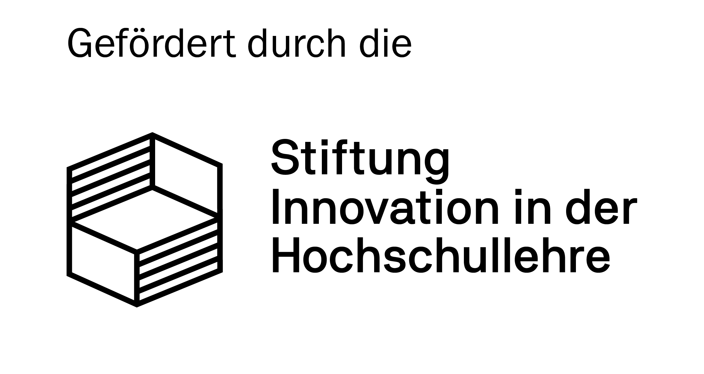

# Qurcuma

A Qt-based GUI for molecular visualization, interactive simulation, and quantum chemistry calculations.



## Features

### 3D Visualization
- **Qt Quick 3D renderer** with Vulkan (auto-fallback to OpenGL)
- Rendering modes: ball-stick, space-filling, wireframe, sticks
- Color schemes: CPK, monochrome, by charge
- Post-processing effects: SSAO, Bloom, HDR, tone mapping, depth fog
- Atom hover highlight, shadows, corner lights
- RMSD overlay (HSV-shifted CPK colors for the second structure)

### Interactive Simulation (MD & Geometry Optimization)
- Backed by [curcuma](https://github.com/conradhuebler/curcuma)'s `SimpleMD` engine
- **Mouse grab**: drag atoms to apply forces during a running MD/Opt
- **Dynamic bonds**: bond topology updated live per frame (hysteresis suppresses flicker)
- **Thermostat selection**: CSVR, Berendsen, Andersen, Nosé-Hoover, None
- **Runtime temperature slider** (color-coded, active during run): drag overrides the current ramp
- Temperature ramps and per-atom temperature regions
- **Confinement walls** (harmonic / LogFermi; sphere or box) with live wireframe visualization
- Iso-potential shells and force-vector field overlay for wall potentials
- Wall violation feedback (recolors wireframe red when atoms leave the box)
- RMSD metadynamics bias (Gaussian flooding to escape local minima)
- **Live charts**: temperature (instant + target) and energy (E_pot / E_kin / E_tot) time series
- Snapshots tab as undo history; auto-snapshot stride configurable
- CLI auto-start: `qurcuma <file> -md` or `qurcuma <file> -opt`

### Structure Editing (Edit Mode)
- Click to select atoms; double-click to select whole molecule (BFS fragment)
- Ctrl/Shift+drag for rubber-band box selection
- Drag to translate; Shift+drag for depth; arrow-key nudge
- WASD/QE scene rotation (full 3-axis) while editing
- Collision detection with clash count and one-click resolve
- Copy / paste / delete atoms (single-frame structures)
- Load and merge molecules from file into the current scene
- Undo via snapshot history

### Analysis
- Distance, angle, and dihedral measurement (auto-detected from selection count)
- RMSD alignment against a reference file with 3D overlay
- Center-at-origin (mass-weighted, Ctrl+Backspace)

### File Formats
- XYZ, VTF (with periodic boundary conditions), PDB, MOL2

### Calculation Management
- Launch and manage ORCA, XTB, and Curcuma jobs from one interface
- Organized project directories with automatic calculation history
- Structure and input-file management

### UI
- **Explore / Compute mode switch** in the menu-bar corner
- **Display dock** with collapsible sections (Style, Effects, Lighting, Tools, Presets)
- **Command palette** (Ctrl+K): fuzzy search over all menu actions and viewer commands
- 4 layout presets (Ctrl+Alt+1–4)

## Requirements

- Qt 6.x (Quick 3D, Charts)
- C++17 compiler
- Vulkan loader (optional — OpenGL fallback is automatic)
- [curcuma](https://github.com/conradhuebler/curcuma) (included as submodule)
- Optional: ORCA, XTB for calculation management

## Build

```bash
git clone https://github.com/conradhuebler/qurcuma.git
cd qurcuma
cmake -B build -DCMAKE_BUILD_TYPE=Release
cmake --build build
```

## Agentic Coding Disclaimer

This project is developed as an **agentic coding** project using [Claude Code](https://claude.ai/code) with models from [Anthropic](https://www.anthropic.com) and free models provided by [Ollama](https://ollama.com). Large parts of the codebase — including the Qt Quick 3D renderer, interactive simulation integration, structure editing, and UI — were written or substantially shaped by AI coding agents under the supervision of the project author.

## Funding

Development funded in 2026 by **Stiftung Innovation in der Hochschullehre (STIL)**.

## Contributing

Pull requests are welcome.
